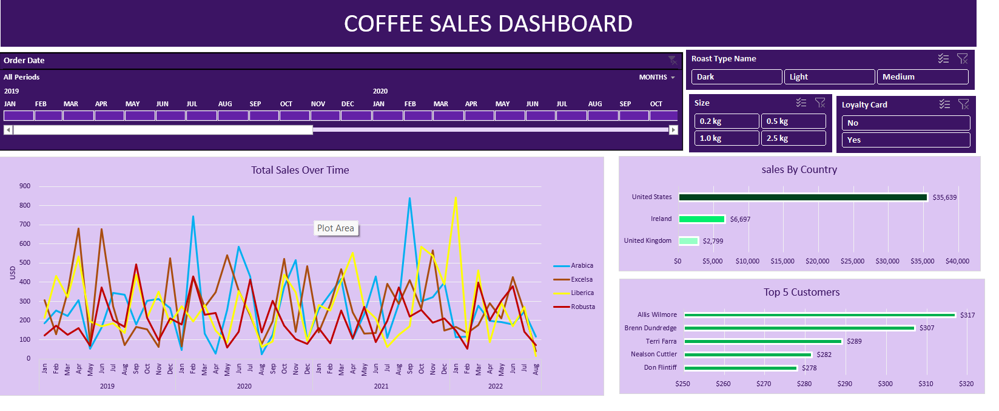

# Coffee Sales Dashboard (Excel)

## Overview

This project is an interactive Coffee Sales Dashboard developed in Microsoft Excel to analyze sales performance using Pivot Tables, Pivot Charts, Timelines, and Slicers.

## Dashboard Preview

---

## Features

- Interactive Timeline Filter
- Roast Type Slicer
- Size Slicer
- Loyalty Card Filter
- Sales Trend Analysis
- Sales by Country
- Top 5 Customers
- Dynamic Pivot Charts
- Interactive Dashboard

---

## Tools Used

- Microsoft Excel
- Pivot Tables
- Pivot Charts
- Timeline
- Slicers
- XLOOKUP
- INDEX-MATCH
- Conditional Formatting

---

## Files

| File | Description |
|------|-------------|
| Coffee_Sales_Dashboard.xlsx | Complete interactive Excel dashboard |
| Coffee_Sales_Dashboard.pdf | Dashboard exported as PDF |
| dashboard.png | Dashboard preview |

---

## Skills Demonstrated

- Data Analysis
- Dashboard Design
- Business Intelligence Reporting
- Data Visualization
- Excel Automation
- Interactive Reporting
